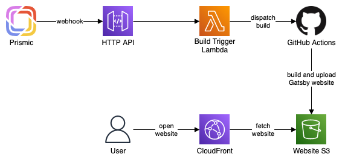

# AWS serverless website with headless CMS

[Gatsby](https://www.gatsbyjs.com/) website
with [Prismic CMS](https://prismic.io/).

The website is automatically built and deployed to AWS
from GitHub Actions after:

- push to the `main` branch,
- publishing changes in Prismic CMS.



For more details, see the article with full description:
[Headless CMS with Gatsby on AWS for $0.00 per month](https://betterdev.blog/gatsby-website-with-headless-cms-on-aws)

## Development

### Set environment variables

Create `.env` file:

```dotenv
PRISMIC_REPO_NAME=
PRISMIC_CUSTOM_TYPES_API_TOKEN=
```

"Repo name" is the part of the Prismic CMS domain before the `.prismic.io`.

Custom Types API token can be created in Prismic → API & Security → Custom Types API.

### Start Gatsby

```bash
yarn run start
```

## Deployment

### Create SSM parameters

| Name                               | Type           | Value                                                             |
|:-----------------------------------|:---------------|:------------------------------------------------------------------|
| `/{service}/{stage}/prismicSecret` | `SecureString` | Generated random value                                            |
| `/{service}/{stage}/github/user`   | `String`       | Repository user, here: `m-radzikowski`                            |
| `/{service}/{stage}/github/repo`   | `String`       | Repository name, here: `aws-website-cms`                   |
| `/{service}/{stage}/github/token`  | `SecureString` | GitHub Personal Access Token with `repo` access to the repository |

Put the Serverless service name as `{service}` (by default "cmswebsite")
and stage name as `{stage}` (by default "dev").

### Deploy stack

```bash
yarn run deploy
```

### Setup Prismic webhook

In Prismic, go to Settings → Webhooks and add new webhook.

For URL, pass API Gateway URL with `/update` endpoint, for example:  
`https://xxxxxxxxxx.execute-api.eu-west-1.amazonaws.com/update`.

For Secret, pass the same value as for `prismicSecret` SSM parameter.

### See website

Website is hosted by CloudFront. You can find the CloudFront Distribution ID
in the CloudFormation. Then, in CloudFront, you can find the website domain name.

## CI

In GitHub repository Settings go to Secrets and add repository secrets:

- `AWS_ACCESS_KEY_ID`
- `AWS_SECRET_ACCESS_KEY`
- `PRISMIC_REPO_NAME`
- `PRISMIC_CUSTOM_TYPES_API_TOKEN`
